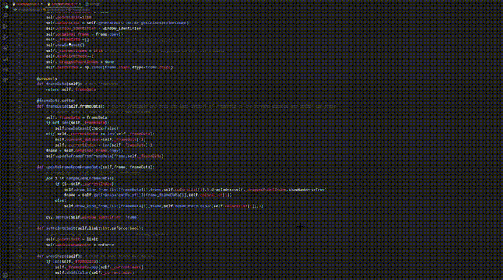

# AnnotateFrame

This class is implemented using python using cv2 and numpy. It allows for the manual labelling of image arrays displayed through opencv's high level GUIs

##  sample of functionality

### Creating shapes by clicking on points or specifying coordinates

### edit shape by dragging individual points, deleting indvidual point or undo last point

### scroll though between different shapes

### changing color of the shape

### loading between different set of shape data


## Using the class
note that AnnotateFrame by default does not include `waitkey()` so it should be called after calling the function to prevent kernel crashes
```
from AnnotateFrame import AnnotateFrame as AF
import cv2

# ... ..

af = AF("opencv window identifier",number_of_colors,image) 

# setting data to the class

#calling this will automatically load and display the data in the specified frame
af.frameData = DATA # where data is in the form of [ [(x,y),(x,y)...],....]

af.setPointLimit(x,True)
# x => maximum number of points in a shape (this do not affect already existing shape if not edited), set true to enforce no new shape if the current shape has less than x points

cv2.setMouseCallback("opencv_window_identifier,af.mouseCallback,[]) # enables mouse interactions

# ___ you can bind the functions below to keypresses ___
af.changeLineColor() # changes the colors of the current line
af.undoShape() # deletes the currently selected shape in the image
```